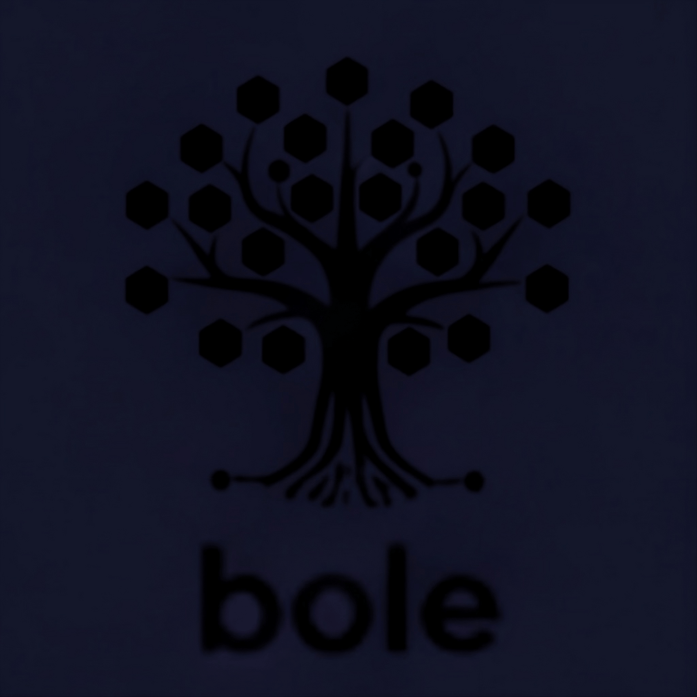

# bole

<div align="center">
  <a href="#bole">
    
  </a>

<div>&nbsp;</div>

> <em>Package managers<br>
> scattered like autumn leaves fall—<br>
> the bole holds them firm.</em>
</div>

## What

Shows which package managers are installed, their versions, locations, and how they were installed.

```
┌────────┬─────────┬──────────────────────────┬──────────────────┬─────────────────┐
│Name    │Version  │Path                      │Via               │Others           │
├────────┼─────────┼──────────────────────────┼──────────────────┼─────────────────┤
│cargo   │1.91.0   │~/.cargo/bin/cargo        │Rustup            │-                │
├────────┼─────────┼──────────────────────────┼──────────────────┼─────────────────┤
│npm     │11.5.1   │/opt/homebrew/bin/npm     │Homebrew          │1 other location │
├────────┼─────────┼──────────────────────────┼──────────────────┼─────────────────┤
│pnpm    │10.14.0  │/usr/local/bin/pnpm       │Node.js → Corepack│-                │
└────────┴─────────┴──────────────────────────┴──────────────────┴─────────────────┘
```

## Install

```bash
cargo install bole
```

## Use

```bash
# Show all package managers
bole show

# Filter by category
bole show system       # brew, nix, macports
bole show javascript   # npm, yarn, pnpm, bun, deno, ni
bole show python       # pip, poetry, uv, conda, pdm, pipx, pipenv
bole show php          # composer, pecl
bole show ruby         # gem, bundler, rvm, rbenv
bole show rust         # cargo
bole show zig          # zig
bole show go           # go toolchain
bole show haskell      # cabal, stack
bole show gleam        # gleam
bole show tools        # asdf, volta, mise, corepack, pyenv, phpbrew

# Category aliases supported
bole show js           # same as javascript
bole show ts           # same as javascript
bole show node         # same as javascript
bole show py           # same as python
bole show rb           # same as ruby
bole show sys          # same as system
bole show rs           # same as rust

# Show all installations with locations
bole show python --all

# Tree format
bole show javascript --tree
```

## Supported

- **System:** Homebrew, MacPorts, Nix
- **JavaScript:** npm, yarn, pnpm, bun, deno, ni
- **Python:** pip, poetry, uv, conda, pdm, pipx, pipenv
- **PHP:** composer, pecl
- **Ruby:** gem, bundler, rvm, rbenv
- **Other:** Rust (cargo), Zig, Go, Haskell (cabal/stack), Gleam
- **Tools:** asdf, volta, mise, corepack, pyenv, phpbrew

## License

MIT
